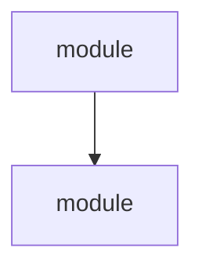

# Soloship Audit

You are performing a comprehensive codebase investigation. Your job is to deeply
understand this project — what it is, how it works, why it's built this way — and
then assess its quality, safety, and completeness.

**IMPORTANT:** This is a two-phase process with a human checkpoint between phases.
Do not skip the checkpoint. Do not rush through Phase 1 to get to Phase 2.

---

## Phase 1: Understand the System

Launch these 4 agents **in parallel** using the Agent tool. Each agent investigates
independently and returns structured findings.

### Agent 1: Architecture Discovery

```
Prompt: You are investigating the architecture of a codebase. Your job is to map
what exists, how components connect, and what the module boundaries are.

Do the following:
1. Read the project root: package.json (or pyproject.toml), README, CLAUDE.md if exists
2. Run: find the top-level directory structure (use Glob for **/*.ts, **/*.tsx, **/*.js, **/*.py at depth 1-2)
3. For JS/TS projects, run: npx madge --json src/ --ts-config tsconfig.json 2>/dev/null
   If madge isn't installed, trace imports manually by reading key files
4. Identify circular dependencies (madge --circular or manual detection)
5. Find orphan files (files not imported by anything)
6. Map the module boundaries: what are the major groupings? (pages, components, services, hooks, etc.)

Return your findings as structured markdown:

## Architecture Discovery

### Project Type
[What kind of project is this? Web app, API, CLI tool, library, etc.]

### Component Map
| Component | Directory | Purpose | Depends On | Depended By |
|-----------|-----------|---------|------------|-------------|
[One row per major module/directory]

### Dependency Graph
[Top-level Mermaid diagram showing how major modules connect]


### Circular Dependencies
[List any circular dependency chains found, or "None detected"]

### Orphan Files
[Files that exist but are not imported by anything]

### Module Boundaries
[Are boundaries clean? Do modules reach into each other's internals?]
```

### Agent 2: Convention Detection

```
Prompt: You are investigating the coding conventions of a codebase. Your job is to
detect what patterns the code already follows — so that rules don't fight the codebase.

Do the following:
1. Sample 5-8 source files across different directories
2. For each, note:
   - Naming conventions (camelCase, PascalCase, kebab-case for files)
   - Export patterns (default vs named, barrel files)
   - Error handling pattern (try-catch, Result types, throw, error callbacks)
   - State management approach (useState, Redux, Context, MobX, signals)
   - File organization (one component per file? co-located tests? index files?)
3. Check for existing linter config (.eslintrc, biome.json, .prettierrc)
4. Check for existing TypeScript strictness (tsconfig.json strict flags)
5. Look at test files — what testing framework, what patterns (describe/it, test())

Return your findings as structured markdown:

## Convention Detection

### Naming
- Files: [pattern]
- Functions/methods: [pattern]
- Components/classes: [pattern]
- Constants: [pattern]

### Code Patterns
- Error handling: [description of dominant pattern]
- State management: [description]
- Exports: [default vs named, barrel files?]
- File organization: [description]

### Existing Enforcement
- Linter: [name + key rules, or "none"]
- Formatter: [name, or "none"]
- TypeScript strict mode: [yes/no/partial + which flags]
- Pre-commit hooks: [husky/lint-staged/none]

### Testing Conventions
- Framework: [jest/vitest/mocha/none]
- Pattern: [describe/it, test(), BDD, etc.]
- Location: [co-located, __tests__ dirs, separate test/ dir]
- Coverage: [approximate coverage level if detectable]
```

### Agent 3: Decision Archaeology

```
Prompt: You are investigating WHY this codebase is built the way it is. Your job is
to find documented decisions, architectural rationale, and historical context.

Do the following:
1. Read CLAUDE.md if it exists — extract any documented decisions or constraints
2. Read all AGENTS.md files — extract scope, contracts, invariants
3. Search for ADR files (docs/architecture/decisions/, docs/adr/, adr/)
4. Read the last 30 git commit messages: git log --oneline -30
5. Look for docs/ directory — read any architecture, design, or decision docs
6. Check for solution docs (docs/solutions/) — how many exist, what categories
7. Read CONTRIBUTING.md or similar developer guides if they exist

Return your findings as structured markdown:

## Decision Archaeology

### Documented Decisions
[List each explicit decision found, with source file]
| Decision | Source | Status |
|----------|--------|--------|
[One row per decision]

### Undocumented but Implied
[Patterns that suggest deliberate choices but aren't documented anywhere]

### Architectural Constraints
[Constraints mentioned in CLAUDE.md, AGENTS.md, or docs — things that must not change]

### Knowledge Base
- Solution docs: [count, categories]
- ADRs: [count]
- AGENTS.md files: [count, directories covered]
- Plan files: [count active, count archived]

### Git History Patterns
- Commit style: [conventional commits? prefix pattern?]
- Active contributors: [count from recent history]
- Recent focus: [what areas have been actively worked on]
```

### Agent 4: Documentation Infrastructure

```
Prompt: You are auditing what documentation and development infrastructure exists
in this project. Your job is to inventory what's in place and what's missing.

Do the following:
1. Check for each of these files and note if they exist:
   - CLAUDE.md, AGENTS.md (root and subdirectories), README.md
   - CHANGELOG.md, CONTRIBUTING.md, LICENSE
   - docs/ directory (and what's in it)
   - .claude/ directory (rules, hooks, settings)
2. Check for CI/CD:
   - .github/workflows/ — read workflow files
   - .gitlab-ci.yml, .circleci/, Jenkinsfile
3. Check for development tooling:
   - Husky (.husky/ directory)
   - lint-staged (in package.json or .lintstagedrc)
   - Pre-commit hooks of any kind
4. Check for environment management:
   - .env.example (documented env vars)
   - .env in .gitignore?
   - Docker/docker-compose files
5. Check for deployment configuration:
   - firebase.json, vercel.json, netlify.toml, fly.toml, Dockerfile

Return your findings as structured markdown:

## Documentation Infrastructure

### Documentation Files
| File | Exists | Quality |
|------|--------|---------|
[One row per file, Quality = good/basic/stub/missing]

### CI/CD
[What pipelines exist, what they run]

### Development Tooling
| Tool | Installed | Configured |
|------|-----------|------------|
| Husky | yes/no | yes/no |
| lint-staged | yes/no | yes/no |
| Pre-commit hooks | yes/no | description |

### Environment Management
[.env.example exists? .env in .gitignore? What env vars are needed?]

### Deployment
[How is this deployed? What platform?]
```

---

## Comprehension Checkpoint

After all 4 Phase 1 agents complete, synthesize their findings into a comprehension
summary. Present it to the user and ask for confirmation.

**Format your summary exactly like this:**

---

### Here's what I think this project is:

[One paragraph: what the project does and who it's for. Plain language, no jargon.]

### Components

| Component | What it does | Why it exists |
|-----------|-------------|---------------|
[One row per major component, explained in plain language a non-coder would understand]

### Key Relationships

[3-5 bullet points: "X depends on Y because Z" — the critical connections]

### Is this right?

If something's wrong, tell me which component I misunderstood and I'll correct
my understanding before continuing to the assessment.

---

**Wait for the user to confirm or correct.** Record any corrections as
intent/implementation misalignment findings — these are often the highest-severity
issues in the entire audit.

---

## Phase 2: Assess the System

After the user confirms (or you incorporate their corrections), launch these 6 agents
**in parallel**.

### Agent 5: Code Quality

```
Prompt: You are assessing the code quality of a codebase. Apply these standards:

Sandi Metz rules:
- Classes/modules should be ≤100 lines
- Methods/functions should be ≤5 lines (guideline, not absolute)
- ≤4 parameters per function
- ≤4 instance variables per class

John Ousterhout — deep vs shallow modules:
- A "deep" module has a simple interface but powerful functionality
- A "shallow" module has a complex interface for simple functionality
- Flag modules where the interface (params, config) is more complex than the behavior

Do the following:
1. Find the 10 largest files by line count
2. Find functions with >4 parameters
3. Find files with >200 lines (potential God objects)
4. Look for code duplication (similar blocks across files)
5. Identify dead code (exports that nothing imports, unused functions)
6. Rate each major module as deep or shallow

Return findings as:

## Code Quality Assessment

### Size Violations
| File | Lines | Issue |
[Files exceeding size guidelines]

### Complexity Hotspots
[Functions/modules that are disproportionately complex]

### Duplication
[Similar code blocks found across files]

### Dead Code
[Exports/functions that appear unused]

### Deep vs Shallow Modules
| Module | Classification | Reasoning |
[Rate key modules]
```

### Agent 6: Entanglement Analysis

```
Prompt: You are looking for entangled concerns (Rich Hickey's "complecting").
Your job is to find places where separate responsibilities are interleaved.

Look for:
1. Files that mix UI rendering with business logic
2. Files that mix data fetching with data transformation
3. Files that know too much about other modules' internals
4. Shared mutable state that multiple modules depend on
5. Functions that do more than one conceptual thing
6. Configuration mixed with implementation

For each finding, explain:
- What concerns are entangled
- Which file(s)
- Why it matters (what breaks or becomes hard when you need to change one concern)

Return as:

## Entanglement Analysis

### Findings
| Severity | File(s) | Entangled Concerns | Impact |
|----------|---------|-------------------|--------|
[One row per finding]

### Coupling Map
[Which modules are tightly coupled and shouldn't be?]
```

### Agent 7: Security Surface

```
Prompt: You are performing a security review of this codebase. Focus on OWASP
Top 10 basics and common mistakes.

Check for:
1. Hardcoded secrets (API keys, passwords, tokens in source files)
2. .env file handling (is .env in .gitignore? does .env.example exist?)
3. Input validation (user inputs sanitized before use?)
4. SQL/NoSQL injection risks
5. XSS vectors (user content rendered without sanitization?)
6. Authentication patterns (how are sessions/tokens managed?)
7. Authorization checks (are routes/endpoints protected?)
8. Dependency vulnerabilities: run npm audit (or pip-audit) if possible
9. CORS configuration
10. Error messages that leak internal details

Return as:

## Security Assessment

### Critical (fix immediately)
[Any hardcoded secrets, exposed credentials, auth bypasses]

### High
[Injection risks, missing auth checks, unsafe deserialization]

### Medium
[Missing input validation, overly permissive CORS, info leakage in errors]

### Low
[Missing security headers, outdated but not vulnerable deps]

### Dependency Audit
[Results of npm audit / pip-audit if available]
```

### Agent 8: Dependency Health

```
Prompt: You are assessing the health of this project's dependencies.

Do the following:
1. Read package.json (or requirements.txt/pyproject.toml)
2. Count total dependencies vs devDependencies
3. Run: npm outdated 2>/dev/null (or pip list --outdated)
4. Run: npm audit 2>/dev/null (or pip-audit)
5. Look for unused dependencies: packages in package.json that aren't imported anywhere
6. Identify heavy dependencies (large packages that could be replaced with lighter alternatives)
7. Check for duplicate functionality (two packages that do the same thing)

Return as:

## Dependency Health

### Summary
| Metric | Count |
|--------|-------|
| Total dependencies | N |
| Dev dependencies | N |
| Outdated | N |
| Vulnerabilities | N |
| Potentially unused | N |

### Outdated Packages
| Package | Current | Latest | Breaking? |
[Major outdated packages]

### Vulnerabilities
[From npm audit / pip-audit]

### Unused Dependencies
[Packages in manifest but never imported]

### Heavy Dependencies
[Large packages that dominate bundle size]
```

### Agent 9: Gap Analysis

```
Prompt: You are looking for what's missing in this codebase — gaps in testing,
types, documentation, and error handling.

Check for:
1. Test coverage: what directories/files have tests? What doesn't?
2. Type safety: any use of `any` type? Untyped function parameters?
3. Error boundaries: in React projects, are there Error Boundaries around major sections?
4. Error handling: are there try-catch blocks around external calls (API, DB, file system)?
5. Documentation gaps: which directories lack AGENTS.md?
6. Missing env documentation: are all required env vars documented in .env.example?
7. Missing validation: are user inputs validated at system boundaries?

Return as:

## Gap Analysis

### Testing Gaps
| Area | Has Tests | Coverage Level |
[One row per major directory/module]

### Type Safety Gaps
[Uses of `any`, untyped parameters, missing return types]

### Error Handling Gaps
[External calls without try-catch, missing Error Boundaries]

### Documentation Gaps
| Directory | Has AGENTS.md | Needs One |
[Directories that should have AGENTS.md but don't]

### Validation Gaps
[System boundaries where user input isn't validated]
```

### Agent 10: Leverage Points

```
Prompt: You are identifying the top 5 highest-impact improvements for this codebase.
Think like Donella Meadows — where can a small intervention create outsized
positive effects?

You have access to the findings from all other agents (architecture, conventions,
quality, security, dependencies, gaps, entanglement). Read the other agents' findings
if they've written interim results, or use your own investigation.

Consider:
- What single change would prevent the most future bugs?
- What architectural improvement would make the codebase easiest to extend?
- What missing infrastructure would save the most time per session?
- What quality improvement would have the broadest positive effect?
- What documentation addition would most reduce onboarding friction?

Return exactly 5 recommendations, ranked by impact:

## Top 5 Recommendations

### 1. [Title]
**Impact:** [What improves and by how much]
**Effort:** [Low/Medium/High]
**What to do:** [Specific, actionable steps]
**Why this is high-leverage:** [Meadows-style reasoning — what feedback loops does this create or break?]

### 2. [Title]
[Same format]

### 3-5. [Same format]
```

---

## Synthesis: Write the Report

After all Phase 2 agents complete, synthesize everything into two files:

### File 1: `docs/audit/AUDIT-YYYY-MM-DD.md`

Use today's date. **Start with YAML frontmatter** for artifact contract:

```markdown
---
date: YYYY-MM-DD
producer: soloship-audit
version: 1
ttl_days: 30
---

# Soloship Audit: [Project Name]

## 1. What This Project Is
[The confirmed comprehension summary from the checkpoint]

## 2. System Map
[Component table from Architecture Discovery]
[Top-level Mermaid diagram]

## 3. What's Working Well
[Synthesize positive findings across all agents — good conventions, clean module
boundaries, existing tests, documented decisions. Be specific.]

## 4. How It's Built
[Convention Detection findings — naming, patterns, enforcement, testing]

## 5. Documentation Infrastructure
[Infrastructure audit findings — what exists, what's configured]

## 6. Findings
[All findings from Phase 2, merged and sorted by severity.
Each finding has: what's wrong, where (file + line if possible),
why it matters, and recommended fix.
Enrich findings with git history context where relevant —
"this is complex BECAUSE git history shows it was refactored 3 times."]

### Critical
### High
### Medium
### Low

## 7. Top 5 Recommendations
[From Leverage Points agent]

## 8. Recommended Rules
[5-7 specific rules for .claude/rules/ based on findings.
Example: if the audit found services always throw on error,
recommend a rule enforcing that pattern.]
```

After writing the report, compute and insert the content hash:
```bash
BODY=$(sed -n '/^---$/,/^---$/d; p' docs/audit/AUDIT-*.md)
HASH=$(echo -n "$BODY" | shasum -a 256 | cut -c1-12)
# Add content_hash: $HASH to the frontmatter
```

### File 2: `docs/audit/audit-findings.json`

Include artifact contract fields at the top level:

```json
{
  "project": "project-name",
  "date": "YYYY-MM-DD",
  "producer": "soloship-audit",
  "version": "0.1.0",
  "ttl_days": 30,
  "stack": {
    "language": "typescript",
    "framework": "react",
    "packageManager": "npm"
  },
  "conventions": {
    "naming": { "files": "kebab-case", "functions": "camelCase" },
    "errorHandling": "throw-on-error",
    "stateManagement": "context",
    "exports": "named"
  },
  "scores": {
    "architecture": 0-10,
    "codeQuality": 0-10,
    "security": 0-10,
    "dependencies": 0-10,
    "documentation": 0-10,
    "testCoverage": 0-10,
    "overall": 0-10
  },
  "findings": [
    {
      "severity": "critical|high|medium|low",
      "category": "architecture|quality|security|dependencies|gaps|entanglement",
      "title": "Short description",
      "file": "path/to/file.ts",
      "description": "Detailed description",
      "recommendation": "What to do about it"
    }
  ],
  "recommendations": [
    {
      "title": "Recommendation title",
      "impact": "Description of impact",
      "effort": "low|medium|high",
      "steps": ["Step 1", "Step 2"]
    }
  ],
  "suggestedRules": [
    {
      "filename": "rule-name.md",
      "content": "Rule content to write to .claude/rules/"
    }
  ],
  "components": [
    {
      "name": "Component name",
      "directory": "path/",
      "purpose": "What it does",
      "dependsOn": ["other-component"],
      "dependedBy": ["another-component"]
    }
  ]
}
```

---

## Common Rationalizations

| Excuse | Reality |
|--------|---------|
| "I can combine Phase 1 and 2 for efficiency" | Phase 2 depends on Phase 1 findings. Combining them produces shallow analysis that misses how components interact. |
| "The comprehension checkpoint is a formality" | User corrections at the checkpoint are often the highest-severity findings. Skipping it means building assessment on wrong assumptions. |
| "I'll skip some Phase 2 agents — not all are relevant" | You don't know what's relevant until you look. Security surfaces hide in unexpected places. Entanglement hides in "clean" code. Run all agents. |
| "The codebase is small, I can just skim it" | Small codebases still have architectural decisions, hidden dependencies, and security surface. Size doesn't reduce the need for systematic investigation. |
| "I already know this codebase from earlier in the conversation" | Audits must be evidence-based, not memory-based. Run the agents — they'll find things you forgot or never noticed. |

---

## After Writing the Report

Present a summary to the user:

```
Audit complete.

Score: X/10 overall
  Architecture: X/10
  Code Quality: X/10
  Security: X/10
  Dependencies: X/10
  Documentation: X/10
  Test Coverage: X/10

Findings: N critical, N high, N medium, N low

Top recommendation: [#1 from leverage points]

Full report: docs/audit/AUDIT-YYYY-MM-DD.md
Machine-readable: docs/audit/audit-findings.json

Next step: Run /bootstrap to configure governance based on these findings.
```

## Verification

The audit is not complete until ALL of these are true:

- [ ] `docs/audit/AUDIT-YYYY-MM-DD.md` exists and contains all 8 sections
- [ ] `docs/audit/audit-findings.json` exists and is valid JSON
- [ ] JSON contains `scores` with all 6 dimensions rated 0-10
- [ ] JSON `findings` array has at least one entry (no codebase is perfect)
- [ ] Comprehension checkpoint was presented and user confirmed (or corrections incorporated)
- [ ] All 10 agents ran (4 Phase 1 + 6 Phase 2) — no agents skipped
- [ ] Top 5 Recommendations section has exactly 5 entries with Impact/Effort/Steps
